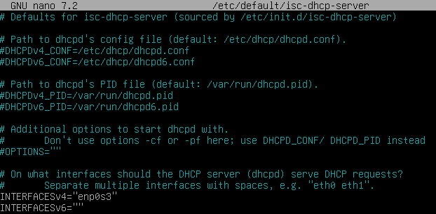
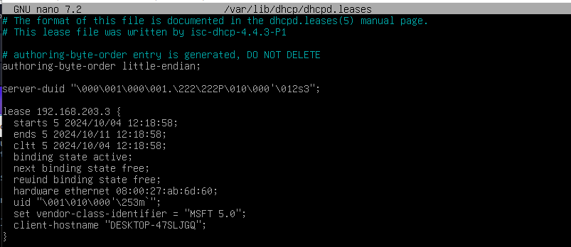

# Practica 2
# Configuración servidor DHCP

### En esta practica lo que haremos será ver como configurar y como funciona un servidor DHCP.

Lo primero que haremos será configurar la red de nuestro servidor.

---

Despues de configurar nuestra red instalaremos el servicio DHCP.

---

En este apartado le diremos al dhcp que interfaz de red es la que queremos usar.

---

Aqui le diremos todos los parametros a configurar asi como:
1. La red y la máscara.
2. El rango de IP's.
3. El DNS principal.
4. El nombre del dominio a usar.
5. La IP de nuestro router.
6. El tiempo de concesión por defecto.
7. El tiempo máximo de concesión.
8. El tiempo mínimo de concesión.

Una vez configurado todo veremos que el servicio esta funcionando.

Aqui configuraremos la reserva de IP la cual queremos darle a nuestro cliente.

---

Una vez configurado nuestros clientes como clientes dhcp en el archivo "/var/lib/dhcp/dhcpd.leases" veremos que se ha dado la concesión de dicha ip. 

En este apartado veremos como con el comando "journalctl -f -u isc-dhcp-server" se ven los accesos del cliente renovando la IP.